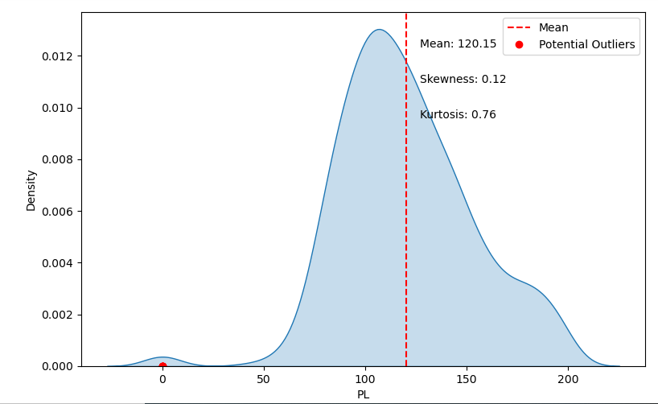
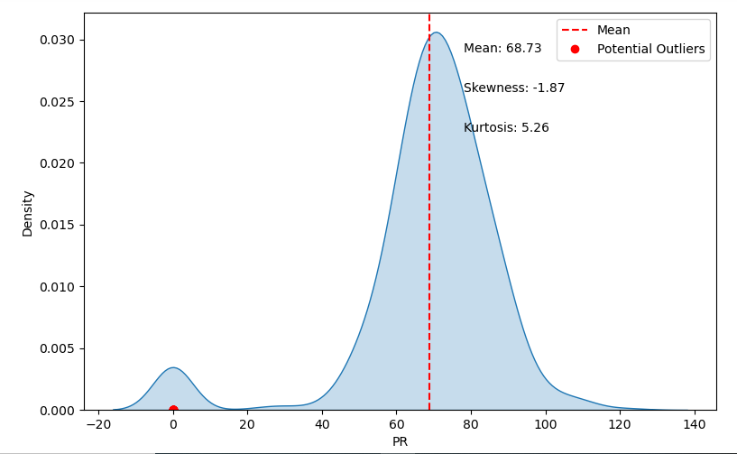
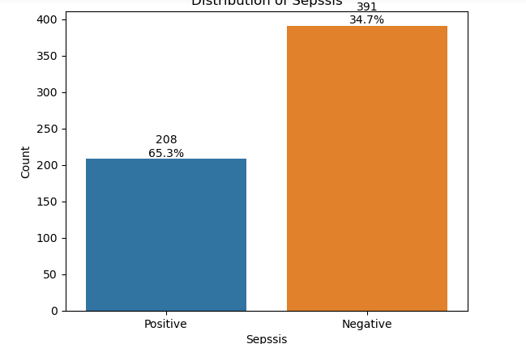
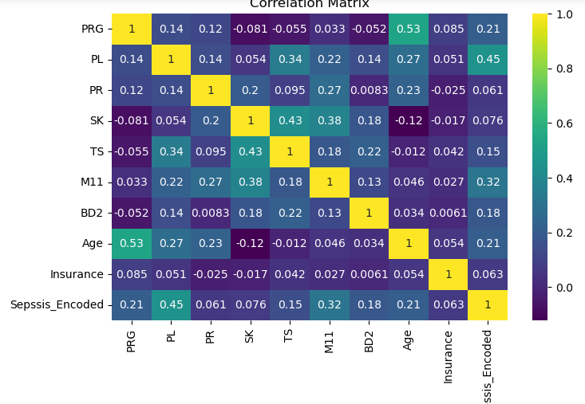
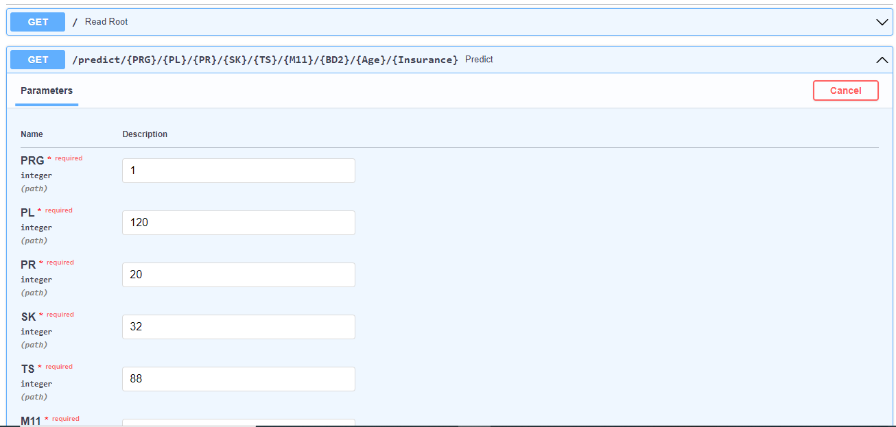
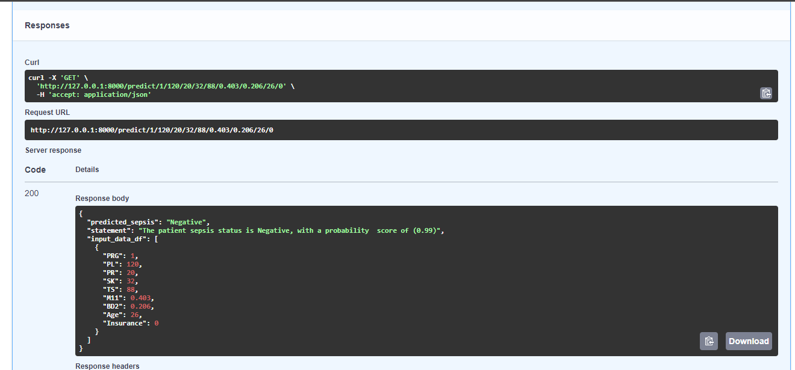

#  Sepsis-Classification_ML-API-using-FastAPI🚀🚀🚀

## Description
This repository contains code, data, and resources for a machine learning project that classifies sepsis and provides an API for accessing the trained model using FastAPI.

## Table of Contents
[Introduction](Introduction)\
[Dataset](Dataset)\
[EDA](EDA)\
[Training](Training)\
[Deployment](Deployment)\
[Set-up](Set-up)\
[Usage](Usage)\
[API-Documentation](API-Documentation)\
[Contributing](Contributing)\
[contact](contact)

## Introduction
Sepsis is a life-threatening condition caused by the body's response to an infection, leading to organ dysfunction. This project aims to develop a machine learning model that can predict the presence of sepsis based on various clinical features. The trained model is deployed as an API using FastAPI, allowing users to interact with the model and get predictions.

The API is built using FastAPI.

## Dataset
The dataset used for training and testing can be found in the ``` Datasets ``` directory. It contains anonymized patient records with different features . The target variable indicates whether the patient has sepsis or not.

The feature are as follows:
| Column Name | Data Features | Description                                      |
|-------------|-----------------|--------------------------------------------------|
| ID          | N/A             | Unique number to represent patient ID             |
| PRG         | Attribute 1     | Plasma glucose                                   |
| PL          | Attribute 2     | Blood Work Result-1 (mu U/ml)                    |
| PR          | Attribute 3     | Blood Pressure (mm Hg)                           |
| SK          | Attribute 4     | Blood Work Result-2 (mm)                         |
| TS          | Attribute 5     | Blood Work Result-3 (mu U/ml)                    |
| M11         | Attribute 6     | Body mass index (weight in kg/(height in m)^2)   |
| BD2         | Attribute 7     | Blood Work Result-4 (mu U/ml)                    |
| Age         | Attribute 8     | Patient's age (years)                            |
| Insurance   | N/A             | If a patient holds a valid insurance card         |
| Sepsis      | Target          | Positive: if a patient in ICU will develop sepsis,<br> Negative: otherwise |

## Exploratory Data Analysis
The notebook (sepsis.ipynb) under the EDA provides insights into the dataset, including data visualization, statistical summaries, and feature analysis. This analysis helps understand the data distribution, identify patterns, and make informed decisions during model development.





## Model Training
The model training process is described in the (sepsis.ipynb) notebook. It covers data preprocessing, model selection, hyperparameter tuning, and evaluation. The trained model is saved in the ```key_comp``` directory for deployment.

The trained model (Lr_model.joblib) is available in the ```key_comp``` directory. This serialized model can be loaded and used for making predictions or further analysis.


## Deployment
The notebook folder contains the necessary files (main.py) and configurations to deploy the model as an API using FastAPI. It includes a Dockerfile for containerization and requirements.txt listing the Python dependencies. Additionally, there are instructions for setting up the API server, including deployment options and environment setup.

## Set up

for windows:
1.Create the Python's virtual environment that isolates the required libraries of the project to avoid conflicts\
```bash
python -m venv venv
```
2.Activate the Python's virtual environment so that the Python kernel & libraries will be those of the isolated environment;\
```bash
venv\Scripts\activate
```


## Usage
To use the API, follow the instructions below:
1. clone the repository to your local machine\
git clone https://github.com/Pendopr/Sepsis-Classification_ML-API-using-FastAPI

### Deyploying FastAPI
Install the required Python dependencies:
```bash
pip install -r requirements.txt
```
Run the FastAPI:

FastAPI:

```bash
uvicorn main:app --reload 
```
The API is now running locally. You can access the documentation and interact with the API by visiting http://localhost:8000 in your browser.

## API Documentation
The API documentation provides details about the available endpoints, request and response formats, and example usage. You can access the documentation by visiting the /docs endpoint after starting the server (http://localhost:8000/docs).




##  Docker Container
The Dockerfile contains a script that describes the necessary steps to build the Docker image for my sepsis classification API. It Includes the required dependencies, such as Python packages, the copy of the model and the copy of my main.py file  

To build the Docker image run the following command in the project's root directory:
```bash
docker build -t my-fastapi-app .
```
Replace 'my-fastapi-app' with the desired name for your Docker image.
Once the image is built, you can run the Docker container with the following command:
```bash 
docker run -d -p host-port:container-port my-fastapi-app
```
Replace 'host-port' with the port number on your host machine that you want to map to the container's port, and 'container-port' with the port number specified in the Dockerfile's EXPOSE instruction.

After rinning the above command the FastAPI will start and runing in the docker container.

## Contribution
Contributions and pull requests are welcome! If you would like to contribute to this project, please follow these steps:

1.Fork this repository.\
2.Create a new branch with a descriptive name \
3.Make your desired changes and commit them.\
4.Push the branch to your forked repository \
5.Open a pull request in this repository and describe your changes.

Feel free to contribute to different aspects of the project, including improving the model, exploring additional features, or enhancing the EDA.

## AUTHOR 
Penina Pendo\
[](https://medium.com/@peninarandu/)

[](https://www.linkedin.com/in/penina-randu-7b004222a/)